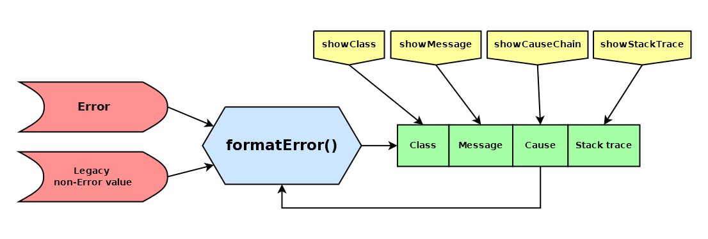

# format-error

_Lightweight library for modern Error formatting_


[](https://badge.fury.io/js/@giancosta86%2Fformat-error)
[](/LICENSE)



**format-error** is a _TypeScript_ library designed to easily convert `Error` objects to `string`; in particular, its `formatError()` function provides:

- support for the `cause` property introduced by **ES 2022**

- customizable behaviour via an additional **options** parameter

- backward compatibility with non-Error objects

## Installation

```bash
npm install @giancosta86/format-error
```

or

```bash
yarn add @giancosta86/format-error
```

The public API entirely resides in the root package index, so you shouldn't reference specific modules.

## Usage

The library provides the following utility functions:

- `formatError(error[,parts])`: given an error value, returns a string including just the requested error parts (see below). By default, only the **class** and the **message** are included.

  > The **error** argument can be anything - although non-`Error` objects will be converted without considering the **parts** argument.

- `toError(error)`: when receiving an `Error`, the function just returns the argument itself; otherwise, it creates an error whose message is the _stringified_ value

### Error parts

`ErrorParts` is a _flag enum_ - describing the different parts of an `Error` that should appear in the result:

- `Class`: the class

- `Message`: the message

* `CauseChain`: the chain of `cause` errors - if available - displaying the related **class** and **message** parts according to the current format

* `Stack`: the stack trace

You can request multiple error parts by combining the enum values - for example:

```typescript
formatError(
  new URIError("Yogi the Bear"),
  ErrorParts.Class | ErrorParts.CauseChain
);
```

Additionally, the shortcut combination values `Core`, `Main` and `All` are available.

**Please, note**: you must specify **at least one** between `Class` and `Message`; otherwise, the function will throw an error
