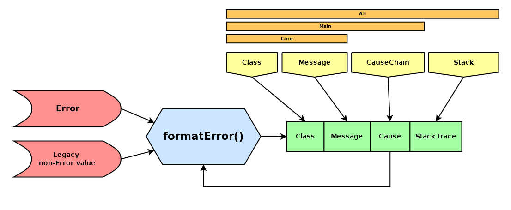

# format-error

_Lightweight library for modern Error formatting_


[](https://badge.fury.io/js/@giancosta86%2Fformat-error)
[](/LICENSE)



**format-error** is a _TypeScript_ library designed to easily convert `Error` objects to `string`; in particular, its `formatError()` function provides:

- support for the `cause` property introduced by **ES 2022**

- customizable behaviour via an additional **options** parameter

- backward compatibility with non-Error objects

## Installation

```bash
npm install @giancosta86/format-error
```

or

```bash
yarn add @giancosta86/format-error
```

## Usage

Just call the `formatError(error[,options])` function, which converts the error to a string.

The **error** argument can be anything - although non-`Error` objects will be converted without considering the **options** argument.

### Options

The _default options_ are always the starting point - but you can _override_ specific items by passing your _custom options_ object, with the following fields:

- **showClass**: if `true`, includes the error's class. **Default**: `true`

- **showMessage**: if `true`, includes the error's message. **Default**: `true`

- **showCauseChain**: if `true`, recursively includes the chain of `cause` errors, formatted according to **showClass** and **showMessage**. **Default**: `false`

- **showStackTrace**: when `true`, the stack trace, if present, will be included. **Default**: `false`

**Please, note**: you can't have both **showClass** and **showMessage** set to `false` - in such a case, the function will throw an error
